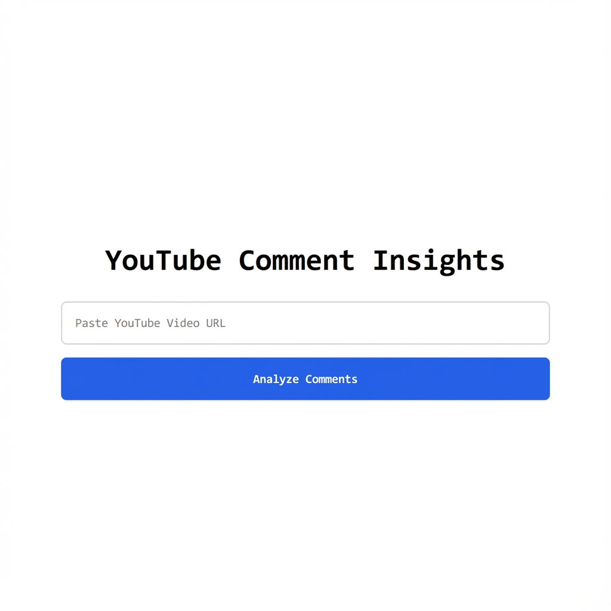
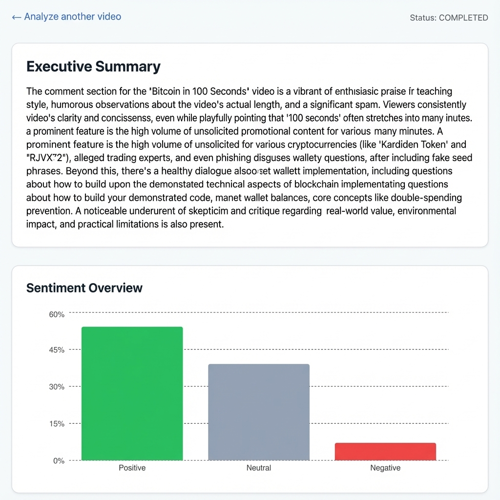
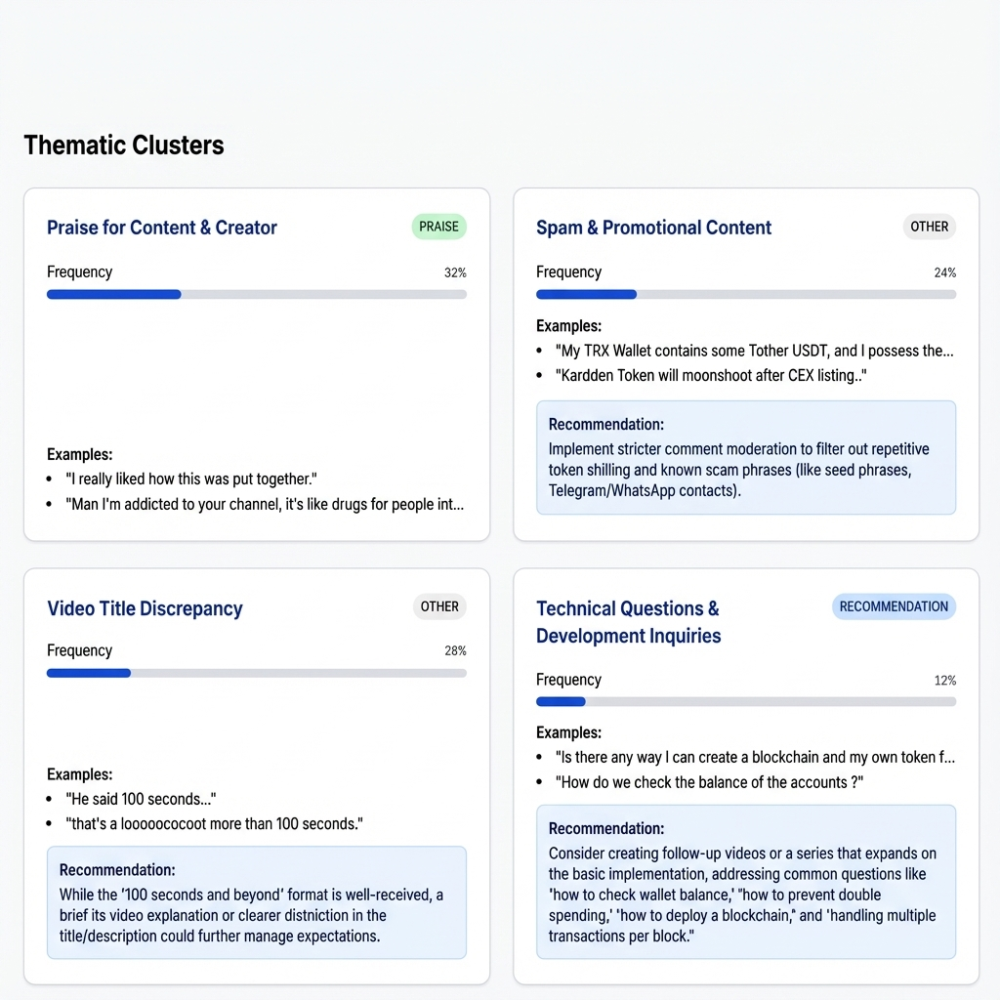

# YouTube Comment Insights

AI-powered analysis of YouTube comment sections. This tool fetches comments from any YouTube video and uses Google's Gemini 2.5 Flash to generate executive summaries, sentiment analysis, and thematic clusters.



## Features

### 📊 Executive Summary & Sentiment Analysis
Get a high-level narrative summary of the discussion and a visual breakdown of positive, neutral, and negative sentiment.



### 🧩 Thematic Clustering
Comments are grouped into meaningful clusters (e.g., "Praise", "Critique", "Questions") with frequency data and representative examples.



## How It Works

1.  **Ingestion**: Fetches comments using the YouTube Data API.
2.  **Processing**: Queues jobs using Redis and processes them with a background worker.
3.  **Analysis**: Uses Gemini 1.5 Pro to analyze sentiment and extract themes.
4.  **Storage**: Saves results to Supabase (Postgres).
5.  **Visualization**: Displays insights in a Next.js dashboard.

## Getting Started (Local Development)

### Prerequisites
- Node.js & pnpm
- Supabase project
- Upstash Redis database
- Google Gemini API Key
- YouTube Data API Key

### Installation

1.  Clone the repository and install dependencies:
    ```bash
    pnpm install
    ```

2.  Configure environment variables:
    - Copy `.env.example` to `.env.local` in `apps/web` and `apps/workers`.
    - Fill in your API keys and database credentials.

3.  Run the application locally:
    ```bash
    pnpm dev:local
    ```

    This will start:
    - **Frontend**: [http://localhost:3000](http://localhost:3000)
    - **Worker**: Background process for analyzing videos.

## Tech Stack
- **Frontend**: Next.js 14, Tailwind CSS, Radix UI
- **Backend**: Node.js, SST (AWS Lambda)
- **Database**: Supabase (Postgres)
- **Queue**: Upstash Redis
- **AI**: Google Gemini 1.5 Pro
