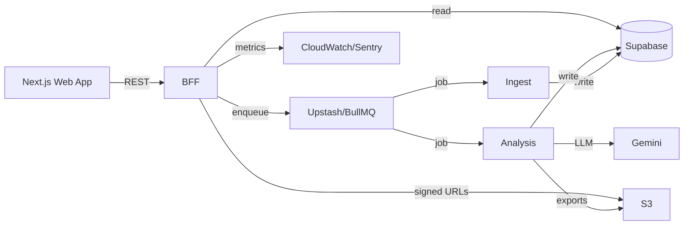
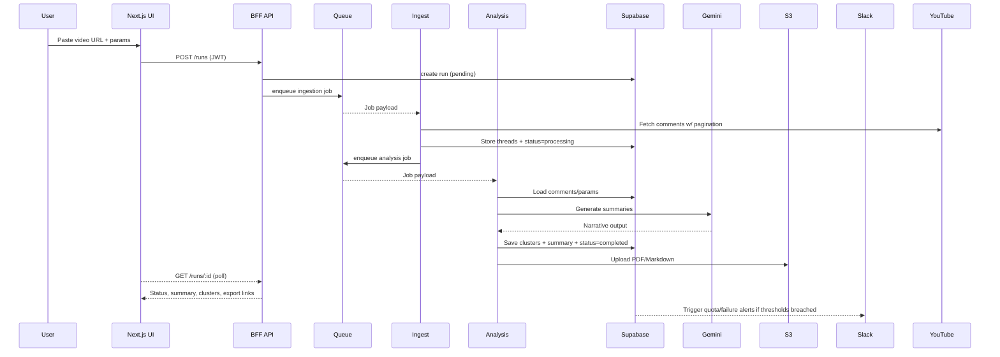

## Introduction

This document establishes the fullstack architecture for **YouTube Comment Insights**, unifying backend ingestion/analysis services with the Vercel-hosted frontend to satisfy the PRD goals (≤2‑minute turnaround for ≤1 000 comments, bilingual WCAG AA experience, proactive quota monitoring). It is the authoritative reference for all AI agents contributing to this repository.

### Starter Template or Existing Project
- No starter codebase exists; the repo currently stores only documentation.
- Decision: treat as a **greenfield** Turborepo monorepo with Next.js + SST-managed Lambdas.
- Constraint: tooling must maximize developer experience (TypeScript everywhere, shared configs) while keeping open the path to future service extraction.

### Change Log
| Date       | Version | Description                                      | Author  |
| ---------- | ------- | ------------------------------------------------ | ------- |
| 2025-11-24 | 0.1     | Initial fullstack architecture draft (greenfield) | Winston |
| 2025-11-24 | 1.0     | Completed architecture with Security and CI/CD    | Winston |

## High Level Architecture

### Technical Summary
Creators interact with a Next.js 14 App Router frontend deployed on Vercel Edge. API routes inside the same project serve as a Backend-for-Frontend (BFF) that validates Supabase Auth tokens, enforces quotas, and enqueues asynchronous work on Upstash Redis (BullMQ). Two AWS Lambda workers (ingestion + analysis) orchestrated via SST process jobs: ingestion fetches comments from the YouTube Data API with retries and stores normalized records in Supabase Postgres; analysis runs clustering logic, invokes Gemini 1.5 Pro via Vertex AI for narrative output, and uploads Markdown/PDF exports to S3. Observability spans CloudWatch dashboards, Sentry (frontend and workers), and Vercel Analytics, providing quota/latency alerts to Slack so Creator Success meets the PRD’s <4 h response SLA.

### Platform & Infrastructure Choice
| Option | Pros | Cons |
| ------ | ---- | ---- |
| **Vercel + AWS + Supabase (Hybrid)** | Best-in-class Next.js DX, granular AWS monitoring, Supabase Auth synergy | Multi-provider secrets/IAM to manage |
| **All-in AWS (Amplify, Lambda, RDS)** | Single control plane, CloudWatch-native everything | Slower frontend iteration, manual SSR optimizations |
| **Fly.io Fullstack** | Global deploy, simple Postgres | Less mature observability + LLM integrations |

**Recommendation:** Hybrid Vercel + AWS Lambda + Supabase + Upstash, balancing DX and operational rigor while enabling shared TypeScript packages.

### Repository Structure
- **Structure:** Monorepo with Turborepo workspaces
- **Apps:** `apps/web` (Next.js UI + BFF) and `apps/workers` (SST Lambdas)
- **Packages:** `packages/shared` (types/Zod), `packages/ui` (Radix/Tailwind components), `packages/prompt-kit` (Gemini prompts), `packages/config` (eslint/ts/tailwind presets)

### Architecture Diagram
```mermaid
graph TD
  User[Creator Browser] -->|HTTPS| Frontend[Next.js Frontend (Vercel Edge)]
  Frontend -->|REST| BFF[Next.js API Routes (BFF)]
  BFF -->|enqueue job| Queue[Upstash Redis / BullMQ]
  Queue -->|trigger| Ingest[Ingestion Lambda]
  Ingest -->|YouTube Data API| YouTube[YouTube API]
  Ingest -->|store comments| Supabase[(Supabase Postgres)]
  Ingest -->|enqueue| Queue
  Queue -->|trigger| Analysis[Analysis Lambda]
  Analysis -->|clusters & summary| Supabase
  Analysis -->|exports| S3[(S3 Bucket)]
  Analysis -->|invoke| Gemini[Vertex AI Gemini]
  BFF -->|fetch insights| Supabase
  BFF -->|signed URLs| S3
  BFF -->|metrics| CloudWatch
  Frontend -->|errors| Sentry
```

### Architectural Patterns
- **Serverless Modular Monolith:** Shared repo with BFF + worker functions keeps complexity low until scale demands decomposition.
- **Backend-for-Frontend:** Tailored REST surface for the dashboard ensures bilingual UX and WCAG states are handled centrally.
- **Event-Driven Queue:** BullMQ decouples slow ingestion/LLM tasks, enabling retries and keeping UI latency low.
- **Repository + Zod Validation:** Shared schemas in `packages/shared` prevent contract drift and allow runtime validation at every boundary.
- **CQRS-lite:** Writes happen via workers; reads exposed via Supabase views/materialized summaries for fast dashboards.
- **Observability-as-Code:** Terraform/SST codify CloudWatch dashboards, alarms, and Slack notifications for quota/latency/costs.

## Tech Stack
| Category | Technology | Version | Purpose | Rationale |
| --- | --- | --- | --- | --- |
| Frontend Language | TypeScript | 5.3 | Shared typing across UI/BFF | Enables AI agents to work safely throughout monorepo |
| Frontend Framework | Next.js | 14.1 | App Router UI + API routes | Aligns with PRD assumptions, bilingual routing, edge rendering |
| UI Library | Radix UI + headless primitives | 2.x | Accessible building blocks | WCAG AA out of the box, easy theming |
| State Management | Zustand + TanStack Query | 4.5 / 5 | Local UI state + async polling | Separates UX concerns from network cache |
| Backend Language | TypeScript | 5.3 | Lambdas + shared libs | Single language for all agents |
| Backend Framework | SST 3 (on AWS Lambda) | 3.x | Worker packaging + infra binding | Combines CDK power with batteries-included DX |
| API Style | REST (JSON) | v1 | Job submission & insight fetch | Simple, flexible for future surfaces |
| Database | Supabase Postgres | 15 | 30-day TTL storage | Managed Postgres + built-in Auth |
| Queue/Cache | Upstash Redis | 7 | BullMQ jobs + ephemeral cache | Serverless Redis with metrics/quota alerts |
| File Storage | AWS S3 | latest | Markdown/PDF exports | Durable storage + signed URLs |
| Authentication | Supabase Auth | latest | Creator login/session | Magic link/OAuth + row-level policies |
| LLM Provider | Vertex AI Gemini 1.5 Pro | latest | Narrative summaries | Paid but offers trial credits, meets production needs |
| Frontend Testing | Vitest + Testing Library | latest | Component/unit | Fast ESM runner |
| Backend Testing | Vitest (Node) + MSW | latest | Lambda/service | Same tooling across stack |
| E2E Testing | Playwright | 1.41 | Workflow + a11y | Cross-browser w/ accessibility checks |
| Build Tool | Turborepo + pnpm | latest | Orchestrate builds/lint/tests | Incremental caching, workspace aware |
| Bundler | Next.js (Webpack/Turbopack) | 14.1 | SSR/ISR bundles | Native to Next.js |
| IaC | Terraform + SST bindings | latest | AWS/S3/Upstash/Supabase infra | Declarative + composable |
| CI/CD | GitHub Actions | latest | Lint/test/deploy | Existing host, supports OIDC |
| Monitoring | Sentry + CloudWatch + Vercel Analytics | latest | Error/perf tracking | Covers browser + serverless |
| Logging | CloudWatch Logs + Supabase log drains | latest | Centralized logs | Supports quota dashboards |
| CSS Framework | Tailwind CSS | 3.4 | Utility-first styling | Fast bilingual theming |

## Data Models

### VideoAnalysisRun
```typescript
export interface VideoAnalysisRun {
  id: string;
  videoId: string;
  userId: string;
  status: "pending" | "processing" | "completed" | "failed";
  language: string;
  sensitivity: number;
  commentCount: number;
  summary: NarrativeSummary | null;
  exports: ExportLinks | null;
  error?: ErrorPayload;
  createdAt: string;
  updatedAt: string;
  completedAt?: string;
}
```

### CommentThread
```typescript
export interface CommentThread {
  id: string;
  runId: string;
  externalId: string;
  author: CommentAuthor;
  text: string;
  language: string;
  sentiment: number;
  engagement: EngagementMetrics;
  publishedAt: string;
  metadata: Record<string, unknown>;
}
```

### CommentCluster
```typescript
export interface CommentCluster {
  id: string;
  runId: string;
  label: string;
  category: ClusterCategory;
  frequency: number;
  sentimentSummary: SentimentBreakdown;
  examples: string[];
  recommendations?: string[];
  llmTraceId: string;
  confidence: number;
}
```

## API Specification (REST)
```yaml
openapi: 3.0.0
info:
  title: YouTube Comment Insights API
  version: v1
servers:
  - url: https://api.youtube-insights.app
  - url: https://staging-api.youtube-insights.app
security:
  - bearerAuth: []
paths:
  /runs:
    post:
      summary: Submit a new analysis run
      responses:
        '202': { description: Accepted }
  /runs/{id}:
    get:
      summary: Retrieve run status + summary
  /runs/{id}/clusters:
    get:
      summary: Fetch thematic clusters
  /runs/{id}/exports:
    get:
      summary: Retrieve signed export URLs
  /quota:
    get:
      summary: Remaining daily quota
```

## Components
- **Next.js Web App:** Video submission, dashboard, localization.
- **BFF API Routes:** Auth validation, quota enforcement, queue orchestration, signed export URLs.
- **Ingestion Worker:** Fetch comments with pagination/retries, normalize text, persist to Supabase, trigger analysis job.
- **Analysis Worker:** Cluster comments, compute sentiment, invoke Gemini for narrative output, store clusters/summary, upload exports.
- **Monitoring Service:** CloudWatch metrics, Supabase usage views, Slack alerts when quota <25% or failures spike.



## External APIs
- **YouTube Data API v3:** `commentThreads.list`, `videos.list` with exponential backoff and quota messaging.
- **Google Vertex AI Gemini 1.5 Pro:** `streamGenerateContent` for narratives; fallback to Gemini Flash during throttling.
- **Slack Webhooks:** Optional but recommended for quota/incident alerts to Creator Success.

## Core Workflows


## Database Schema (Supabase)
```sql
create table public.video_analysis_runs (
  id uuid primary key default gen_random_uuid(),
  user_id uuid not null references auth.users(id),
  video_id text not null,
  status text not null check (status in ('pending','processing','completed','failed')),
  language text not null,
  sensitivity numeric not null check (sensitivity between 0.1 and 1),
  comment_count integer default 0,
  summary jsonb,
  exports jsonb,
  error jsonb,
  created_at timestamptz default now(),
  updated_at timestamptz default now(),
  completed_at timestamptz
);

create table public.comment_threads (
  id uuid primary key default gen_random_uuid(),
  run_id uuid not null references public.video_analysis_runs(id) on delete cascade,
  external_id text not null,
  author jsonb,
  text text not null,
  language text,
  sentiment numeric,
  engagement jsonb,
  published_at timestamptz,
  metadata jsonb,
  created_at timestamptz default now()
);

create table public.comment_clusters (
  id uuid primary key default gen_random_uuid(),
  run_id uuid not null references public.video_analysis_runs(id) on delete cascade,
  label text not null,
  category text not null check (category in ('praise','critique','recommendation','debate','other')),
  frequency numeric not null,
  sentiment_summary jsonb,
  examples text[],
  recommendations text[],
  llm_trace_id text,
  confidence numeric,
  created_at timestamptz default now()
);

create table public.cluster_comments (
  cluster_id uuid references public.comment_clusters(id) on delete cascade,
  comment_id uuid references public.comment_threads(id) on delete cascade,
  primary key (cluster_id, comment_id)
);

create policy "Enable all for authenticated users" on public.video_analysis_runs for all to authenticated with check (auth.uid() = user_id);
create policy "Enable all for authenticated users" on public.comment_threads for all to authenticated using (exists (select 1 from video_analysis_runs where video_analysis_runs.id = comment_threads.run_id));
create policy "Enable all for authenticated users" on public.comment_clusters for all to authenticated using (exists (select 1 from video_analysis_runs where video_analysis_runs.id = comment_clusters.run_id));

create policy "Delete runs older than 30 days" on public.video_analysis_runs for delete using (created_at < now() - interval '30 days');
```

## Frontend Architecture

### Component Organization
The frontend is organized by feature, with shared components, hooks, and services in dedicated directories.
```text
apps/web/
├── app/              # Next.js App Router pages, layouts, and API routes
├── components/       # Shared, stateless UI components (e.g., Radix wrappers)
│   └── ui/
├── features/         # Components implementing specific business logic (e.g., video submission form)
├── hooks/            # Shared React hooks (e.g., useMediaQuery)
├── stores/           # Zustand stores for global client-side state
├── services/         # API client and other external service interactions
└── styles/           # Global styles and Tailwind configuration
```

### Component Template
This example shows a typical "dumb" component that receives data and renders it according to design specifications.
```typescript
import { Card, CardContent, CardHeader } from "@/components/ui/card";
import { Cluster } from "@repo/shared/types";

export function InsightCard({ cluster }: { cluster: Cluster }) {
  return (
    <Card role="article" aria-label={`Tema ${cluster.label}`}>
      <CardHeader>
        <h3 className="text-lg font-semibold">{cluster.label}</h3>
        <p className="text-sm text-muted-foreground">
          {cluster.frequency}% · {cluster.category}
        </p>
      </CardHeader>
      <CardContent className="space-y-2">
        <p>{cluster.recommendations?.[0]}</p>
        <ul className="list-disc pl-4 text-sm">
          {cluster.examples.map((example) => (
            <li key={example}>{example}</li>
          ))}
        </ul>
      </CardContent>
    </Card>
  );
}
```

## Security & Compliance

- **Authentication:** Creator identity is managed via Supabase Auth, which provides JWTs for authenticating API requests to the BFF and subsequent service calls.
- **Authorization:** Data access is restricted using Supabase's Row-Level Security (RLS). Policies ensure users can only access `video_analysis_runs` and associated data that they own.
- **Secrets Management:** Vercel Environment Variables are used for frontend/BFF secrets. SST's `Config` feature handles secrets for the Lambda workers, drawing from AWS Secrets Manager.
- **Data Protection:** All data is encrypted at rest by default in Supabase (Postgres) and AWS S3. Communication is secured with TLS 1.2+. The system enforces a 30-day data retention policy via a `DELETE` policy in the database.
- **Compliance:** The frontend will adhere to WCAG AA accessibility standards, enforced through a combination of Radix UI primitives and Playwright-based E2E tests.

## Scalability & Performance

- **Frontend:** Deployed to Vercel's Edge Network, ensuring low-latency delivery of static assets and server-rendered pages globally.
- **Backend Compute:** The architecture uses auto-scaling, serverless AWS Lambdas for the ingestion and analysis workers. Concurrency limits can be configured to manage costs and downstream API pressure.
- **Database:** Supabase's managed Postgres provides connection pooling via Supavisor. For read-heavy workloads, the schema is designed to allow for materialized views or read replicas if necessary.
- **Queue System:** Upstash Redis (with BullMQ) is a highly-available, serverless solution that can handle millions of jobs, decoupling the UI from backend processing and providing a robust retry mechanism.
- **Identified Bottlenecks:** The primary scaling constraint is the YouTube Data API v3 quota. The system is designed to handle quota exhaustion gracefully by providing clear user feedback and pausing job processing. Proactive monitoring will alert the support team when quotas run low.

## Deployment & CI/CD

- **Monorepo Strategy:** Turborepo orchestrates the build, test, and lint processes, with incremental caching to ensure fast pipeline execution. `pnpm` is used for efficient package management.
- **Continuous Integration (CI):** A GitHub Actions workflow is triggered on every push and pull request to the `main` branch. The workflow runs linting, unit tests (Vitest), and E2E tests (Playwright).
- **Frontend Deployment:** The `apps/web` Next.js application is automatically deployed to Vercel. Pushes to `main` trigger a production deployment, while pull requests generate isolated preview deployments.
- **Backend Deployment:** The `apps/workers` SST application is deployed to AWS Lambda. The CI/CD pipeline uses SST stages (`production`, `staging`) to manage environments, deploying via `sst deploy --stage <name>`. OIDC is configured between GitHub Actions and AWS for secure, keyless deployments.

## Decision Log

- **ADR-001: Monorepo vs. Polyrepo.**
  - **Decision:** Adopt a Turborepo monorepo.
  - **Rationale:** Maximizes code/type sharing (`packages/shared`), simplifies dependency management, and streamlines the developer experience for a small, cross-functional team of AI agents.
- **ADR-002: Hybrid Cloud vs. All-in-one Provider.**
  - **Decision:** Use a hybrid of Vercel (frontend), AWS (workers), Supabase (DB/Auth), and Upstash (Queue).
  - **Rationale:** Leverages the best-in-class developer experience and feature set of each specialized platform, resulting in faster development and a more robust final product.
- **ADR-003: Asynchronous Queue-based Processing vs. Synchronous API Calls.**
  - **Decision:** Implement an asynchronous, queue-based architecture using BullMQ.
  - **Rationale:** Decouples the user-facing API from slow, unpredictable third-party services (YouTube API, Gemini). This improves UI responsiveness, enables robust error handling and retries, and allows for independent scaling of processing workers.