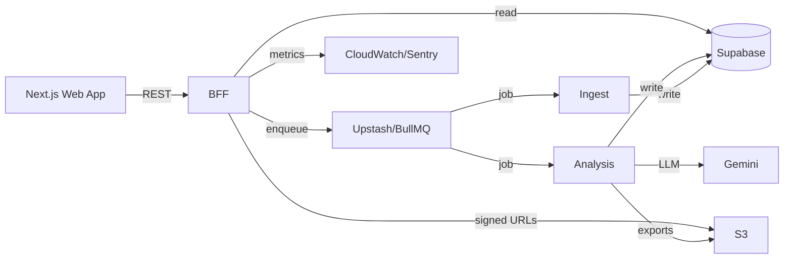

# Components
- **Next.js Web App:** Video submission, dashboard, localization.
- **BFF API Routes:** Auth validation, quota enforcement, queue orchestration, signed export URLs.
- **Ingestion Worker:** Fetch comments with pagination/retries, normalize text, persist to Supabase, trigger analysis job.
- **Analysis Worker:** Cluster comments, compute sentiment, invoke Gemini for narrative output, store clusters/summary, upload exports.
- **Monitoring Service:** CloudWatch metrics, Supabase usage views, Slack alerts when quota <25% or failures spike.

