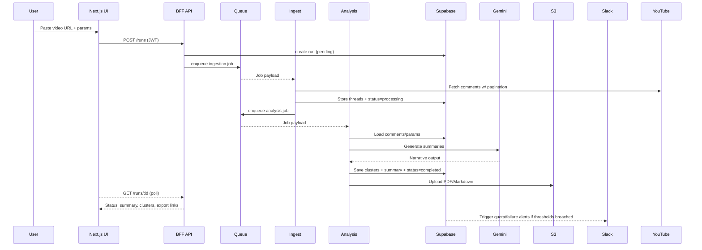

# Core Workflows

```mermaid
sequenceDiagram
  participant User
  participant Web as Next.js UI
  participant BFF as BFF API
  participant Queue
  participant Ingest
  participant Analysis
  participant DB as Supabase
  participant Gemini
  participant Storage as S3
  participant Alerts as Slack

  User->>Web: Paste video URL + params
  Web->>BFF: POST /runs (JWT)
  BFF->>DB: create run (pending)
  BFF->>Queue: enqueue ingestion job
  Queue-->>Ingest: Job payload
  Ingest->>YouTube: Fetch comments w/ pagination
  Ingest->>DB: Store threads + status=processing
  Ingest->>Queue: enqueue analysis job
  Queue-->>Analysis: Job payload
  Analysis->>DB: Load comments/params
  Analysis->>Gemini: Generate summaries
  Gemini-->>Analysis: Narrative output
  Analysis->>DB: Save clusters + summary + status=completed
  Analysis->>Storage: Upload PDF/Markdown
  Web-->>BFF: GET /runs/:id (poll)
  BFF-->>Web: Status, summary, clusters, export links
  DB-->>Alerts: Trigger quota/failure alerts if thresholds breached
```
